# 3420 Assignment #3 - Fall 2023

Name(s): Akash Bahl (0470368) Farzad Imran (0729901)

Live Loki link(s): <https://loki.trentu.ca/~demiimran/3420/assn/assn3/>

Credentials for a test account already in your database: Username: Cement
            Password: moleman
            Another Account: w, e

## Rubric

| Component                                                    | Grade |
| :----------------------------------------------------------- | ----: |
| Dynamic Nav                                                  |    /1 |
| Include Page Template Files (header, nav, etc)               |    /1 |
| Register (account and list)                                  |    /4 |
| Edit Account (account and list)                              |    /5 |
| Delete Account                                               |    /2 |
| Login                                                        |    /3 |
| Logout                                                       |    /1 |
| Forgot Password                                              |    /3 |
| Main Page                                                    |    /7 |
| Public List                                                  |    /2 |
| Edit List Item                                               |    /5 |
| Delete Item                                                  |    /2 |
| View List Item                                               |    /3 |
| Search                                                       |    /3 |
|                                                              |       |
| Meaningful Validation                                        |    /2 |
| Security Considerations(hashing, encoding & escaping, etc, page lockdown) |    /3 |
| Code Quality (tidyness, validity, etc)                       |    /3 |
| Documentation                                                |    /5 |
| Testing                                                      |    /5 |
|                                                              |       |
| Bonus                                                        |       |
| Deductions (readability, submission guidelines, originality) |       |
|                                                              |       |
| Total                                                        |   /60 |

## Things to consider for Bonus Marks (if any)

## Wrappers (header, nav, footer)

### HTML/PHP

```xml
<nav>
    <ul>
        <li><a href="./index.php"><i class="fa-solid fa-house"></i></a></li>
        <li><a href="./list.php"><i class="fa-solid fa-clipboard-list"></i></a></li>
        <?php
        if (isset($_SESSION['username'])) {
            // Display user-specific links when logged in
            echo '<li><a href="./logout.php"><i class="fa-solid fa-right-from-bracket"></i></a></li>';
            echo '<li><a href="./edit-account.php"><i class="fa-solid fa-user-edit"></i></a></li>';
            echo '<li><a href="./delete-account.php"><i class="fa-solid fa-user-times"></i></a></li>';
        } else {
            // Display login and register links when logged out
            echo '<li><a href="./login.php"><i class="fa-solid fa-right-to-bracket"></i></a></li>';
            echo '<li><a href="./register.php"><i class="fa-solid fa-user-plus"></i></a></li>';
        }
        ?>
        <li><a href="./search.php"><i class="fa-solid fa-magnifying-glass"></i></a></li>
    </ul>
</nav>

<footer>&copy; 2023 - Farzad Imran & Akash Bahl</footer>

```


### Testing (include one test for each dynamic version of your menu)


## Register

### HTML/PHP

```xml
<?php

// declare error array
$errors = array();


// delcare defaults
$name               = $_POST['name'] ?? "";
$gender             = $_POST['gender'] ?? "";
$username           = $_POST['username'] ?? "";
$email              = $_POST['email'] ?? "";
$password           = $_POST['password'] ?? "";
$confirmPassword    = $_POST['confirm_password'] ?? "";
$title              = $_POST['title'] ?? "";
$description        = $_POST['description'] ?? "";
$public             = $_POST['public_view'] ?? 'Public';


//Include library and connect to DB
require './includes/library.php';

$pdo = connectDB();

//validate the form
if (isset($_POST['submit'])) {
  // Sanitize all text inputs
  $name               = htmlspecialchars($name);
  $gender             = htmlspecialchars($gender);
  $username           = htmlspecialchars($username);
  $email              = htmlspecialchars($email);
  $password           = htmlspecialchars($password);
  $confirmPassword    = htmlspecialchars($confirmPassword);
  $title              = htmlspecialchars($title);
  $description        = htmlspecialchars($description);
  
  //basic form validation
  if (strlen($name) == 0) {
    $errors['name'] = true;
  }
  if (strlen($gender) == 0) {
    $errors['gender'] = true;
  }
  if (strlen($username) == 0) {
    $errors['username'] = true;
  }else {
    // Check if username is unique
    $query ="SELECT id FROM 3420_assg_users WHERE username = ?";
    $stmt = $pdo->prepare($query);
    $stmt->execute([$username]);

    if ($stmt->rowCount() > 0) {
      $errors['username'] = null;
      $errors['unique'] = true;
    }
  }
  if (filter_var($email, FILTER_VALIDATE_EMAIL) === false) {
    $errors['email'] = true;
  }
  if (strlen($password) == 0) {
    $errors['password'] = true;
  }
   // Validate password match
   if ($password !== $confirmPassword) {
    $errors['match'] = true;
  }
  if (strlen($title) == 0) {
    $errors['title'] = true;
  }
  if (strlen($description) == 0) {
    $errors['description'] = true;
  }


  if (count($errors) === 0) { 

    // Hash the password
    $hashedPassword = password_hash($password, PASSWORD_DEFAULT);

    // Insert user data into the database
    $userquery = "INSERT INTO 3420_assg_users (`name`, `gender`, `username`, `email`, `password`) VALUES (?, ?, ?, ?, ?)";
    $users_stmt = $pdo->prepare($userquery);
    $users_stmt->execute([$name, $gender, $username, $email, $hashedPassword]);

    $get_uid = "SELECT `id` FROM `3420_assg_users` WHERE `3420_assg_users`.`username` = ?";
    $uid = $pdo->prepare($get_uid);
    $uid->execute([$username]);
    $result = $uid->fetch(PDO::FETCH_ASSOC);
    $userid = $result['id'];
    $listquery = "INSERT INTO 3420_assg_lists (`user_id`, `title`, `description`, `publicity`) VALUES (?, ?, ?, ?)";
    $list_stmt = $pdo->prepare($listquery);
    $list_stmt->execute([$userid, $title, $description, $public]);

    // Redirect to login page
    header("Location: login.php");
    exit();
  }
}
?>

<!DOCTYPE html>
<html lang="en">

<head>
  <meta charset="UTF-8">
  <meta name="viewport" content="width=device-width, initial-scale=1.0">
  <script src="https://kit.fontawesome.com/05ad49203b.js" crossorigin="anonymous"></script>
  <title>Register</title>
  <!-- include javascript and css-->
  <link rel="stylesheet" href="styles/main.css">
  <script defer src="js/scripts.js"></script>
</head>

<body>
  <header>
    <!--This will be the main heading of the page so users know what page they're on-->
    <h1>Create An Account</h1>

    <?php include './includes/nav.php' ?>
  </header>
  <main>
    <form method="post" action="">
      <fieldset>
        <legend>Account Information</legend>
        <div>
          <label for="name">Name:</label>
          <input type="text" id="name" name="name" value="<?= $name ?>">
          <span class="error <?= !isset($errors['name']) ? 'hidden' : '' ?>">Please Enter a Name.</span>
        </div>
        <div>
          <label for="gender">Gender</label>
          <select name="gender" id="gender">
            <option value="">Please Choose One</option>
            <option value="male"<?php if($gender == "male") echo "selected='selected'"; ?>>Male</option>
            <option value="female"<?php if($gender == "female") echo "selected='selected'"; ?>>Female</option>
            <option value="gnc"<?php if($gender == "gnc") echo "selected='selected'"; ?>>Gender Queer/Non-Conforming</option>
            <option value="notsay"<?php if($gender == "notsayy") echo "selected='selected'"; ?>>Prefer not to say</option>
          </select>
          <span class="error <?= !isset($errors['gender']) ? 'hidden' : '' ?>">Please Choose a Gender.</span>
        </div>

        <div class="container">
          <label for="username">Username:</label>
          <input type="text" id="username" name="username" value="<?= $username ?>" >
          <span class="error <?= !isset($errors['username']) ? 'hidden' : '' ?>">Please Enter a Username.</span>
          <span class="error <?= !isset($errors['unique']) ? 'hidden' : '' ?>">Invalid Username!</span>
        </div>
        <div>
          <label for="email">Email:</label>
          <input type="email" id="email" name="email" value="<?= $email ?>" >
          <span class="error <?= !isset($errors['email']) ? 'hidden' : '' ?>">Enter a Valid Email.</span>
        </div>

        <div>
          <label for="password">Password:</label>
          <input type="password" id="password" name="password" value="<?= $password ?>" >
          <span class="error <?= !isset($errors['password']) ? 'hidden' : '' ?>">Please Enter a Password.</span>
        </div>
        <div>
          <label for="confirm_password">Confirm Password:</label>
          <input type="password" id="confirm_password" name="confirm_password" value="<?= $confirmPassword ?>">
          <span class="error <?= !isset($errors['match']) ? 'hidden' : '' ?>">Passwords Do Not Match.</span>
        </div>
      </fieldset>
      <fieldset>
        <legend>Create Your First List</legend>
        <div>
          <label for="title">Title:</label>
          <input type="text" id="title" name="title" value="<?= $title ?>">
          <span class="error <?= !isset($errors['title']) ? 'hidden' : '' ?>">Please Choose a List Title.</span>
        </div>
        <div>
          <label for="description">Description:</label>
          <textarea id="description" name="description" ><?= $description ?></textarea>
          <span class="error <?= !isset($errors['description']) ? 'hidden' : '' ?>">Please Describe Your List.</span>
        </div>
        <div>
          <label for="public_view">Make List Public?:</label>
          <input type="hidden" id="public_view" name="public_view" value="Private">
          <input type="checkbox" id="public_view" name="public_view" value="Public" checked>
        </div>
      </fieldset>
      <button id="submit" name="submit">Register</button>
    </form>
  </main>
  <?php include './includes/footer.php' ?>
</body>

</html>
```

### Testing
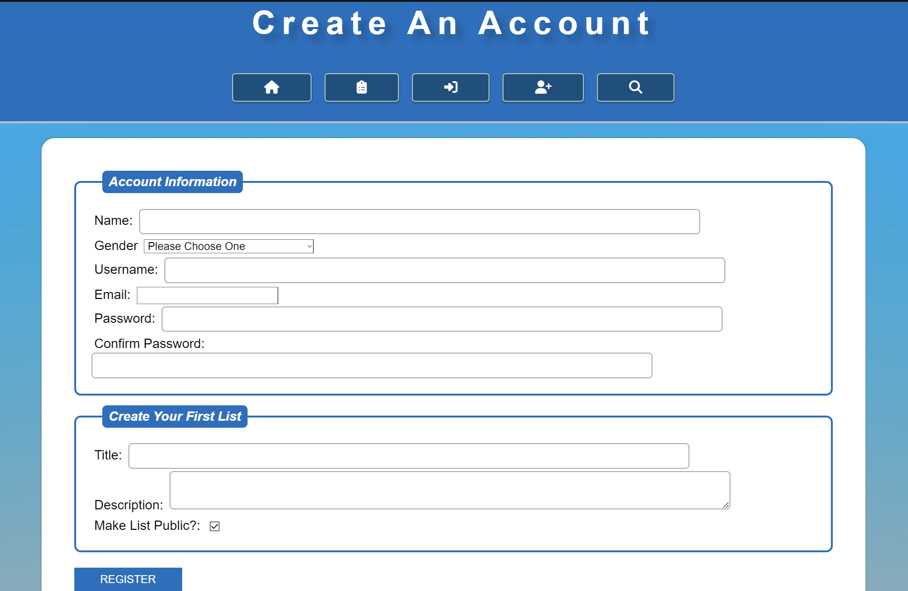
## Edit Account

### HTML/PHP

```xml
<?php
session_start();

require './includes/library.php';

$pdo = connectDB();

// Check if the user is logged in
if (!isset($_SESSION['user_id'])) {
    header('Location: login.php'); // Redirect to login page if not logged in
    exit();
}

$user_id = $_SESSION['user_id'];

// Fetch user data
$stmtUser = $pdo->prepare("SELECT * FROM 3420_assg_users WHERE id = ?");
$stmtUser->execute([$user_id]);
$user = $stmtUser->fetch();

// Initialize variables with default values or retrieve them from $user
    $name = isset($_POST['name']) ? $_POST['name'] : $user['name'];
    $gender = isset($_POST['gender']) ? $_POST['gender'] : $user['gender'];
    $username = isset($_POST['username']) ? $_POST['username'] : $user['username'];
    $email = isset($_POST['email']) ? $_POST['email'] : $user['email'];
    $password = isset($_POST['password']) ? $_POST['password'] : '';
    $confirm_password = isset($_POST['confirm_password']) ? $_POST['confirm_password'] : '';

// Handle user information update
if ($_SERVER['REQUEST_METHOD'] === 'POST' && isset($_POST['updateUser'])) {

    // Initialize variables with default values or retrieve them from $user
    $name = isset($_POST['name']) ? $_POST['name'] : $user['name'];
    $gender = isset($_POST['gender']) ? $_POST['gender'] : $user['gender'];
    $username = isset($_POST['username']) ? $_POST['username'] : $user['username'];
    $email = isset($_POST['email']) ? $_POST['email'] : $user['email'];
    $password = isset($_POST['password']) ? $_POST['password'] : '';
    $confirm_password = isset($_POST['confirm_password']) ? $_POST['confirm_password'] : '';

    // Sanitize all text inputs
    $name               = htmlspecialchars($name);
    $gender             = htmlspecialchars($gender);
    $username           = htmlspecialchars($username);
    $email              = htmlspecialchars($email);
    $password           = htmlspecialchars($password);
    $confirm_password    = htmlspecialchars($confirm_password);


    // Simple validation 
    if (empty($name) || empty($gender) || empty($username) || empty($email)) {
        $userUpdateError = 'All fields are required for user information update.';
    } else {
        // Update user information in the database
        $stmtUserUpdate = $pdo->prepare("UPDATE 3420_assg_users SET name = ?, gender = ?, username = ?, email = ? WHERE id = ?");
        $stmtUserUpdate->execute([$name, $gender, $username, $email, $user_id]);

        // Update password if provided
        if (!empty($password)) {
            // Validate password
            if ($password !== $confirm_password) {
                $userUpdateError = 'Password and confirm password do not match.';
            } else {
                // Update password in the database
                $hashedPassword = password_hash($password, PASSWORD_DEFAULT);
                $stmtPasswordUpdate = $pdo->prepare("UPDATE 3420_assg_users SET password = ? WHERE id = ?");
                $stmtPasswordUpdate->execute([$hashedPassword, $user_id]);
            }
        }

        $userUpdateSuccess = 'User information updated successfully.';
    }
}


?>

<!DOCTYPE html>
<html lang="en">
<head>
    <meta charset="UTF-8">
    <meta name="viewport" content="width=device-width, initial-scale=1.0">
    <script src="https://kit.fontawesome.com/05ad49203b.js" crossorigin="anonymous"></script>
    <title>Edit Account</title>
    <!-- include javascript and css-->
    <link rel="stylesheet" href="styles/main.css">
    <script defer src="js/scripts.js"></script>
</head>
<body>
    <header>
        <!--This will be the main heading of the page so users know what page they're on-->
        <h1>Edit Your Account</h1>

        <?php include './includes/nav.php' ?>
    </header>
    <main>
        <!-- User Information Update Form -->
        <form action="edit-account.php" method="post">
            <fieldset>
                <legend>Update User Information</legend>

                <?php
                if (isset($userUpdateError)) {
                    echo '<div class="error">' . $userUpdateError . '</div>';
                } elseif (isset($userUpdateSuccess)) {
                    echo '<div class="success">' . $userUpdateSuccess . '</div>';
                }
                ?>

                <div>
                    <label for="name">Name:</label>
                    <input type="text" id="name" name="name" value="<?php echo htmlspecialchars($name); ?>" required>
                </div>
                <div>
                    <label for="gender">Gender</label>
                    <select name="gender" id="gender" required>
                        <option value="male" <?php echo ($gender === 'male') ? 'selected' : ''; ?>>Male</option>
                        <option value="female" <?php echo ($gender === 'female') ? 'selected' : ''; ?>>Female</option>
                        <option value="gnc" <?php echo ($gender === 'gnc') ? 'selected' : ''; ?>>Gender Queer/Non-Conforming</option>
                        <option value="notsay" <?php echo ($gender === 'notsay') ? 'selected' : ''; ?>>Prefer not to say</option>
                    </select>
                </div>
                <div class="container">
                    <label for="username">Username:</label>
                    <input type="text" id="username" name="username" value="<?php echo $username; ?>" required>
                </div>
                <div>
                    <label for="email">Email:</label>
                    <input type="email" id="email" name="email" value="<?php echo $email; ?>" required>
                </div>

                <div>
                    <label for="password">Password:</label>
                    <input type="password" id="password" name="password">
                </div>
                <div>
                    <label for="confirm_password">Confirm Password:</label>
                    <input type="password" id="confirm_password" name="confirm_password">
                </div>
                <span>Leave blank to keep the current password.</span>
            </fieldset>

            <input type="submit" name="updateUser" value="Update User Information">
        </form>
    </main>
    <?php include './includes/footer.php' ?>
</body>
</html>
```

### Testing

## Delete Account

### HTML/PHP

```xml

<?php
require './includes/library.php';

session_start();

// Check if the user is logged in
if (!isset($_SESSION['username'])) {
    header("Location: login.php");
    exit();
}

$pdo = connectDB();

// Fetch user ID from the database based on the current session
$username = $_SESSION['username'];
$stmt = $pdo->prepare("SELECT id FROM 3420_assg_users WHERE username = ?");
$stmt->execute([$username]);
$userID = $stmt->fetchColumn();
// Check if the user has confirmed the account deletion
if (isset($_POST['confirmDelete'])) {
    // Delete all data associated with the user
    $stmtDeleteLists = $pdo->prepare("DELETE FROM 3420_assg_lists WHERE user_id = ?");
    $stmtDeleteLists->execute([$userID]);

    $stmtDeleteUser = $pdo->prepare("DELETE FROM 3420_assg_users WHERE username = ?");
    $stmtDeleteUser->execute([$username]);

// Destroy the session
session_destroy();

// Redirect to login
header("Location: login.php");
exit();
}
?>

<!DOCTYPE html>
<html lang="en">
<head>
    <meta charset="UTF-8">
    <meta name="viewport" content="width=device-width, initial-scale=1.0">
    <script src="https://kit.fontawesome.com/05ad49203b.js" crossorigin="anonymous"></script>
    <title>Delete Account</title>
    <!-- include CSS-->
    <link rel="stylesheet" href="styles/main.css">
    <script defer src="js/scripts.js"></script>
</head>
<body>
    <header>
        <!--This will be the main heading of the page so users know what page they're on-->
        <h1>Delete Account</h1>
        <?php include './includes/nav.php' ?>
    </header>
    <main>
        <form action="delete-account.php" method="post">
            <fieldset>
                <legend>Confirmation</legend>
                <p>Are you sure you want to delete your account? This action cannot be undone.</p>
                <div>
                    <button type="submit" name="confirmDelete" class="big-button">Yes, I'm sure. Delete my account</button>
                </div>
            </fieldset>
        </form>
    </main>
    <?php include './includes/footer.php' ?>
</body>
</html>

```

### Testing
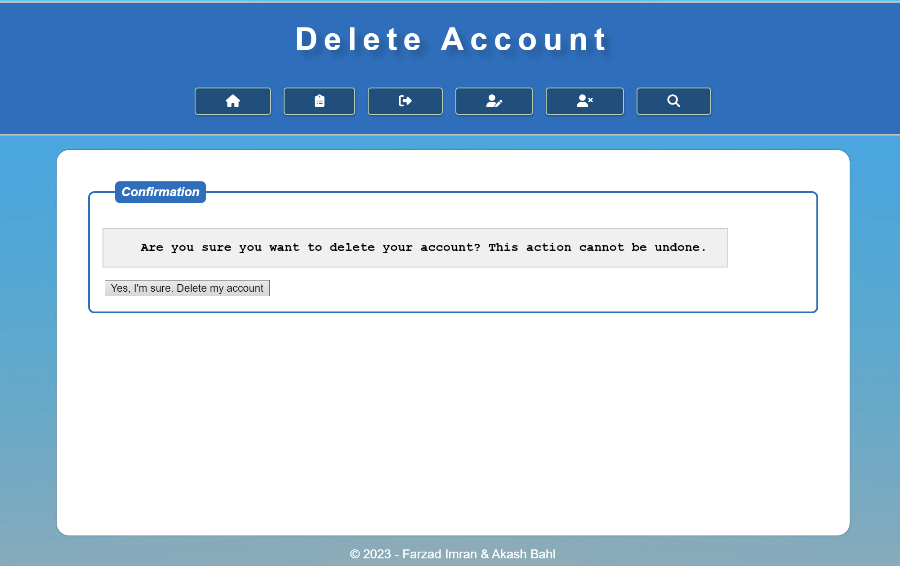
## Login

### HTML/PHP

```xml
<!--PHP section-->
<?php
require './includes/library.php';
session_start(); // Start the session

// Check if the user is already logged in, if so, redirect to the Main Page
if (isset($_SESSION['username'])) {
    header("Location: index.php");
    exit();
}

// Check if a cookie exists, if yes, pre-populate the username box
if (isset($_COOKIE['remember_me'])) {
    $prepopulatedUsername = $_COOKIE['remember_me'];
} else {
    $prepopulatedUsername = '';
}

// Check if the form is submitted
if ($_SERVER["REQUEST_METHOD"] == "POST") {
  $pdo = connectDB();
  $username = $_POST['username'];
  $password = $_POST['password'];

  // Sanitize all text inputs
  $username= htmlspecialchars($username);
  $password= htmlspecialchars($password);

  $rememberMe = isset($_POST['remember_me']) ? $_POST['remember_me'] : false;

  // Fetch user data from the database
  $stmt = $pdo->prepare("SELECT id, password FROM 3420_assg_users WHERE username = ?");
  $stmt->execute([$username]);
  $userData = $stmt->fetch();

  // Verify password
  if ($userData && password_verify($password, $userData['password'])) {
      // Password is correct, start a new session
      session_start();

      // Store user data in session variables
      $_SESSION['username'] = $username;
      $_SESSION['user_id'] = $userData['id'];

      // Create a cookie if "remember me" is checked
      if ($rememberMe) {
          setcookie('remember_me', $username, time() + (86400 * 30), "/"); // 30 days
      } else {
          // If "remember me" is not checked, clear the cookie
          setcookie('remember_me', '', time() - 3600, "/");
      }

      // Redirect to the Main Page
      header("Location: index.php");
      exit();
  } else {
      $error_message = "Invalid username or password";
  }
}
?>

<!DOCTYPE html>
<html lang="en">
  <head>
    <meta charset="UTF-8">
    <meta name="viewport" content="width=device-width, initial-scale=1.0">
    <script
      src="https://kit.fontawesome.com/05ad49203b.js"
      crossorigin="anonymous"
    ></script>
    <title>Login</title>
    <!-- include javascript and css-->
    <link rel="stylesheet" href="styles/main.css">
    <script defer src="js/scripts.js"></script>
  </head>
  <body>
    <header>
      <!--This will be the main heading of the page so users know what page they're on-->
      <h1>Login</h1>

      <?php include './includes/nav.php' ?>
    </header>
    <main>
    <?php
      if (isset($error_message)) {
          echo "<p>$error_message</p>";
      }
      ?>
      No account? You can <a href="register.php">sign up now!</a>
      <form action="login.php" method="post" class="login">
        <fieldset>
          <legend>Login Information</legend>
          <div>
            <label for="username">Username:</label>
            <input
              type="text"
              id="username"
              name="username"
              maxlength="32"
              placeholder="ex. JohnDoe123"
              required
            >
          </div>
          <div>
            <label for="password">Password:</label>
            <input type="password" id="password" name="password" required>
          </div>

          <div>
            <label for="remember_me">Remember me:</label>
            <input type="checkbox" id="remember_me" name="remember_me">
          </div>
        </fieldset>
        <div>
          <a href="forgot.php">Forgot Password?</a>
        </div>
        <input type="submit" value="Login">
      </form>
    </main>
    <?php include './includes/footer.php' ?>
  </body>
</html>
```

### Testing
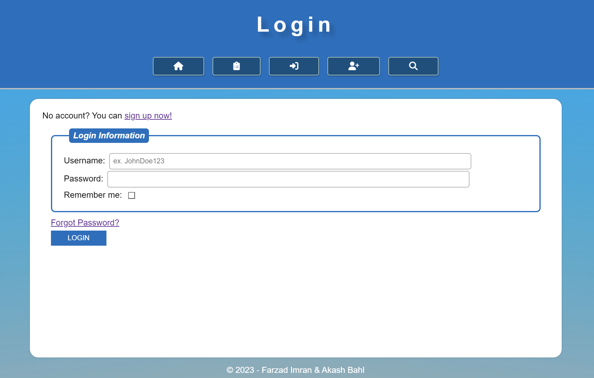
## Logout

### HTML/PHP

```xml

<?php
// Start or resume the current session
session_start();

// Destroy the session
session_destroy();
?>

<!DOCTYPE html>
<html lang="en">
<head>
    <meta charset="UTF-8">
    <meta name="viewport" content="width=device-width, initial-scale=1.0">
    <script src="https://kit.fontawesome.com/05ad49203b.js" crossorigin="anonymous"></script>
    <title>Delete Account</title>
    <!-- include CSS-->
    <link rel="stylesheet" href="styles/main.css">
    <script defer src="js/scripts.js"></script>
</head>
<body>

  <header>
    <!-- This will be the main heading of the page so users know what page they're on -->
    <h1>You Have Successfully Logged Out</h1>
    <?php include './includes/nav.php'; ?>
  </header>

  <main>
      <p>Thank you for using our site. You have successfully logged out!</p>
  </main>

  <?php include './includes/footer.php'; ?>
</body>
</html>


```

### Testing
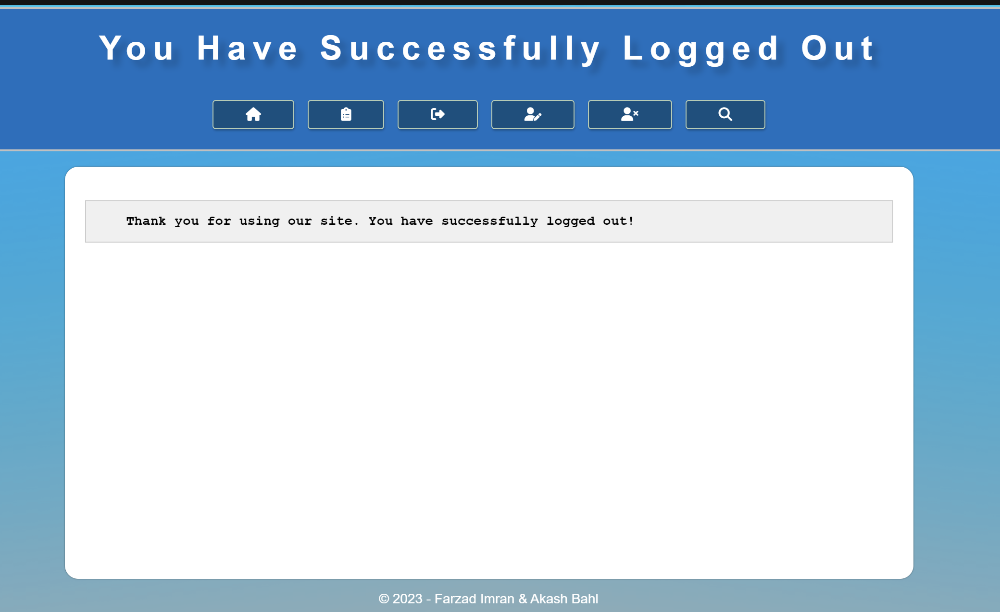
## Forgot Password (collect email, send mail)

### HTML/PHP

```xml
<!DOCTYPE html>
<html lang="en">
  <head>
    <meta charset="UTF-8">
    <meta name="viewport" content="width=device-width, initial-scale=1.0">
    <script
      src="https://kit.fontawesome.com/05ad49203b.js"
      crossorigin="anonymous"
    ></script>
    <title>Forgot Password</title>
    <!-- include javascript and css-->
    <link rel="stylesheet" href="styles/main.css">
    <script defer src="js/scripts.js"></script>
  </head>
  <body>
    <header>
      <!--This will be the main heading of the page so users know what page they're on-->
      <h1>Forgot Password</h1>

      <?php include './includes/nav.php' ?>
    </header>
    <main>
      <form action="process-forgot-password.php" method="post">
        <div>
          <label for="usernameOrEmail">Username or Email:</label>
          <input
            type="text"
            id="usernameOrEmail"
            name="usernameOrEmail"
            value="<?php echo isset($_POST['usernameOrEmail']) ? htmlspecialchars($_POST['usernameOrEmail']) : ''; ?>"
            required
          >
        </div>
        <div>
          <label for="newPassword">New Password:</label>
          <input type="password" id="newPassword" name="newPassword" required>
        </div>
        <input type="submit" value="Reset Password">
      </form>
    </main>
    <?php include './includes/footer.php' ?>
  </body>
</html>


```

## Forgot Password (use url value to change password)

### HTML/PHP

```xml 
<!DOCTYPE html>
<html lang="en">
  <head>
    <meta charset="UTF-8">
    <meta name="viewport" content="width=device-width, initial-scale=1.0">
    <script
      src="https://kit.fontawesome.com/05ad49203b.js"
      crossorigin="anonymous"
    ></script>
    <title>Forgot Password</title>
    <!-- include javascript and css-->
    <link rel="stylesheet" href="styles/main.css">
    <script defer src="js/scripts.js"></script>
  </head>
  <body>
    <header>
      <!--This will be the main heading of the page so users know what page they're on-->
      <h1>Forgot Password</h1>

      <?php include './includes/nav.php' ?>
    </header>
    <main>
      <form action="process-forgot-password.php" method="post">
        <div>
          <label for="usernameOrEmail">Username or Email:</label>
          <input
            type="text"
            id="usernameOrEmail"
            name="usernameOrEmail"
            value="<?php echo isset($_POST['usernameOrEmail']) ? htmlspecialchars($_POST['usernameOrEmail']) : ''; ?>"
            required
          >
        </div>
        <div>
          <label for="newPassword">New Password:</label>
          <input type="password" id="newPassword" name="newPassword" required>
        </div>
        <input type="submit" value="Reset Password">
      </form>
    </main>
    <?php include './includes/footer.php' ?>
  </body>
</html>


```

### Testing
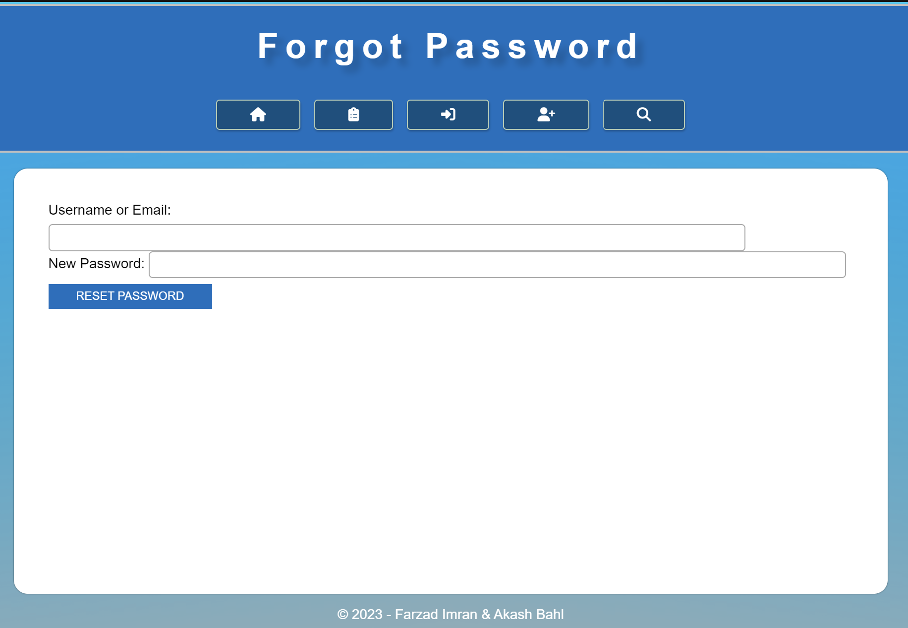
## Main Page

### HTML/PHP

```xml
<?php
session_start(); // Start the session

// Check if the user is logged in
if (!isset($_SESSION['user_id'])) {
    // Redirect to the login page if not logged in
    header("Location: login.php");
    exit();
}
$userid = $_SESSION['user_id'];
// declare error array
$errors = array();


// delcare defaults
$title              = $_POST['title'] ?? "";
$description        = $_POST['description'] ?? "";
$public             = $_POST['public_view'] ?? 'Public';


//Include library and connect to DB
require './includes/library.php';

$pdo = connectDB();
if (isset($_POST['submit'])) {
  if (strlen($title) == 0) {
    $errors['title'] = true;
  }
  if (strlen($description) == 0) {
    $errors['description'] = true;
  }

  if (count($errors) === 0) { 
    // Sanitize all text inputs
    $title= htmlspecialchars($title);
    $description= htmlspecialchars($description);
    
    
    $listquery = "INSERT INTO 3420_assg_lists (`user_id`, `title`, `description`, `publicity`) VALUES (?, ?, ?, ?)";
    $list_stmt = $pdo->prepare($listquery);
    $list_stmt->execute([$userid, $title, $description, $public]);
    
    // refresh page
    header("Location: index.php");
    exit();
  }
}
?>

<!DOCTYPE html>
<html lang="en">

<head>
  <meta charset="UTF-8">
  <meta name="viewport" content="width=device-width, initial-scale=1.0">
  <script src="https://kit.fontawesome.com/05ad49203b.js" crossorigin="anonymous"></script>
  <title>Index</title>
  <!-- include javascript and css-->
  <link rel="stylesheet" href="styles/main.css">
  <script defer src="js/scripts.js"></script>
</head>

<body>
  <header>
    <!--This will be the main heading of the page so users know what page they're on-->
    <h1>Welcome to the Main Page</h1>

    <?php include './includes/nav.php' ?>
  </header>

  <main>
    <h2>My Lists</h2>
    <ul>
    <?php
            // Fetch and display user's lists from the database
            $varpub ="Public";
            $varpriv ="Private";
            $query = "SELECT list_id, user_id, title FROM 3420_assg_lists WHERE publicity = ? OR user_id = ? AND publicity = ?";
            $stmt = $pdo->prepare($query);
            $stmt->execute([$varpub, $userid, $varpriv]);
            $user_lists = $stmt->fetchAll();

            foreach ($user_lists as $list) :
            ?>
      <li><a href="view-item.php?id=<?php echo $list["list_id"]; ?>"><?= $list["title"] ?></a> 
      <?php if ($list["user_id"] == $userid) { ?> 
        <a href="edit-item.php?id=<?php echo $list["list_id"]; ?>"><i class="fa-solid fa-pen-to-square"></i></a>
          <a href="delete-item.php?id=<?php echo $list["list_id"]; ?>"><i class="fa-solid fa-trash"></i></a>
        </button>
      <?php } ?>
        <?php endforeach; ?>
      </li>
    </ul>
    <h2>Add New Entry:</h2>
    <form method="post" action="">
    <div>
          <label for="title">Title:</label>
          <input type="text" id="title" name="title" value="<?= $title ?>">
          <span class="error <?= !isset($errors['title']) ? 'hidden' : '' ?>">Please Choose a List Title.</span>
        </div>
        <div>
          <label for="description">Description:</label>
          <textarea id="description" name="description" ><?= $description ?></textarea>
          <span class="error <?= !isset($errors['description']) ? 'hidden' : '' ?>">Please Describe Your List.</span>
        </div>
        <div>
          <label for="public_view">Make List Public?:</label>
          <input type="hidden" id="public_view" name="public_view" value="Private">
          <input type="checkbox" id="public_view" name="public_view" value="Public" checked>
        </div>
      </fieldset>
      <button id="submit" name="submit">Make List</button>
    </form>
  </main>
  <?php include './includes/footer.php' ?>
</body>

</html>

```

### Testing
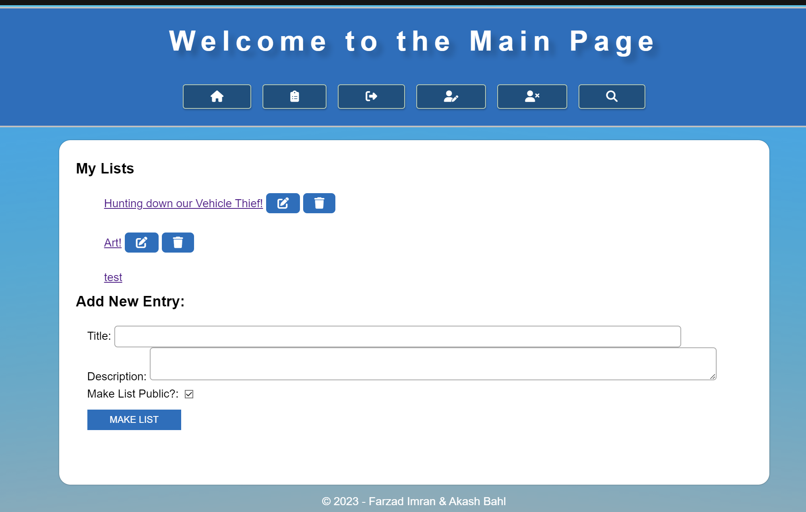
## Public View of List

### HTML/PHP

```xml
<?php
//Include library and connect to DB
require './includes/library.php';

$pdo = connectDB();
?>

<!DOCTYPE html>
<html lang="en">

<head>
  <meta charset="UTF-8">
  <meta name="viewport" content="width=device-width, initial-scale=1.0">
  <script src="https://kit.fontawesome.com/05ad49203b.js" crossorigin="anonymous"></script>
  <title>Index</title>
  <!-- include javascript and css-->
  <link rel="stylesheet" href="styles/main.css">
  <script defer src="js/scripts.js"></script>
</head>

<body>
  <header>
    <!--This will be the main heading of the page so users know what page they're on-->
    <h1>Public View</h1>

    <?php include './includes/nav.php' ?>
  </header>

  <main>
    <h2>User Lists</h2>
    <ul>
    <?php
            // Fetch and display user's lists from the database
            $varpub ="Public";
            $query = "SELECT list_id, title FROM 3420_assg_lists WHERE publicity = ?";
            $stmt = $pdo->prepare($query);
            $stmt->execute([$varpub]);
            $user_lists = $stmt->fetchAll();

            foreach ($user_lists as $list) :
            ?>
      <li><a href="view-item.php?id=<?php echo $list["list_id"]; ?>"><?= $list["title"] ?></a> 
        <?php endforeach; ?>
      </li>
    </ul>
  </main>
  <?php include './includes/footer.php' ?>
</body>

</html>

```

### Testing
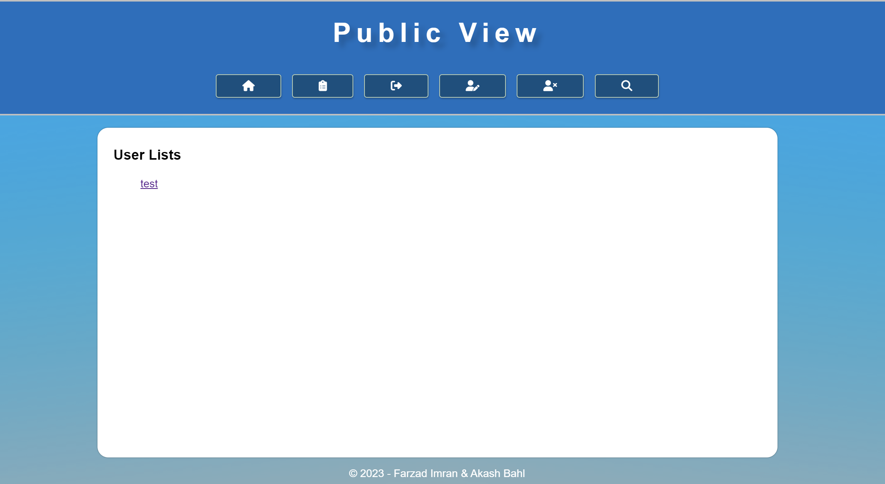
## Edit Item

### HTML/PHP

```xml
<?php
session_start(); // Start the session

// Check if the user is logged in
if (!isset($_SESSION['user_id'])) {
    // Redirect to the login page if not logged in
    header("Location: login.php");
    exit();
}
if(isset($_GET['id'])){
  $list_id = $_GET['id'];}

$userid = $_SESSION['user_id'];
// declare error array
$errors = array();


// delcare defaults
$title              = $_POST['title'] ?? "";
$description        = $_POST['description'] ?? "";
$status             = $_POST['status'] ?? "";
$details            = $_POST['details'] ?? "";
$proof              = $_FILES['proof'] ?? null;
$rating             = $_POST['rating'] ?? "50";
$comp_date          = $_POST['completionDate'] ?? "";
$public             = $_POST['public_view'] ?? 'Public';
$oldfile            = false;


//Include library and connect to DB
require './includes/library.php';

$pdo = connectDB();
$check = "SELECT user_id FROM 3420_assg_lists WHERE list_id = ?";
$checkownership = $pdo->prepare($check);
$checkownership->execute([$list_id]);
$result = $checkownership->fetch(PDO::FETCH_ASSOC);
if ($result['user_id'] != $userid){
  header("Location: index.php");
}
$getdata = "SELECT * FROM 3420_assg_lists WHERE list_id = ?";
$userdata= $pdo->prepare($getdata);
$userdata->execute([$list_id]);
$formdata = $userdata->fetch(PDO::FETCH_ASSOC);

if (isset($_POST['submit'])) {
      
    // Sanitize all text inputs
    $title= htmlspecialchars($title);
    $description= htmlspecialchars($description);
    $details= htmlspecialchars($details);

 if (strlen($title) == 0) {
    $errors['title'] = true;
  }
  if (strlen($description) == 0) {
    $errors['description'] = true;
  }
  $valid_status = ["o", "p", "c"];
  if (!in_array($status, $valid_status)) {
    $errors['status'] = true;
  }
  if (strlen($details) === 0) {
    $errors['details'] = true;
  }
  if (isset($formdata['image_url']) && !isset($_FILES["proof"])){
    $oldfile = true;
  }
  else{
    $allowed_image_extension = array(
        "png",
        "jpg",
        "jpeg"
    );
    
    //Set Variables for File Upload
    $file_extension = pathinfo($_FILES["proof"]["name"], PATHINFO_EXTENSION);
    $maxsize    = 1500000;
    $path = WEBROOT."www_data/";
    $fileroot = "ListImage";
    
  if (!isset($formdata['image_url'])) //Removes the file check if there is already one in the directory!
  {

    // Validate file input to check if is not empty
    if (!file_exists($_FILES["proof"]["tmp_name"])) {
        $errors['proof'] = true;
    }    // Validate file input to check if is with valid extension
    else if (!in_array($file_extension, $allowed_image_extension)) {
        $errors['prooftype'] = true;
    }    // Validate image file size
    else if (($_FILES["proof"]["size"] >= $maxsize || ($_FILES["proof"]["size"] == 0))) {
        $errors['proofsize'] = true;
    }
    elseif(is_uploaded_file($_FILES["proof"]['tmp_name'])){
          //get the original file name for extension, where 'fileToProcess' was the name of the
          //file upload form element
          $filename = $_FILES["proof"]['name'];
          $exts = explode(".", $filename); // split based on period
          $ext = $exts[count($exts)-1]; //take the last split (contents after last period)
          $filename = $fileroot.$list_id.".".$ext;  //build new filename
          $newname = $path.$filename; //add path the file name

          // delete previous file in folder (as ones with different extensions would not be replaced)
          if(isset($formdata['image_url'])){
            $del_file = $path.$formdata['image_url'];
            array_map( "unlink", glob($del_file));
            }
          move_uploaded_file($_FILES['proof']['tmp_name'], $newname);
        }

  }
  else {
      //get the original file name for extension, where 'fileToProcess' was the name of the
      //file upload form element
      $filename = $_FILES["proof"]['name'];

      // Get the old extension
      $oldexts = explode(".", $formdata['image_url']);
      $oldext = $oldexts[count($oldexts)-1];

      $exts = explode(".", $filename); // split based on period
      $ext = $exts[count($exts)-1]; //take the last split (contents after last period)

      if (!empty($ext)){
      $filename = $fileroot.$list_id.".".$ext;  //build new filename
      $newname = $path.$filename; //add path to the file name
      echo "$filename";}
      else {
        $filename = $fileroot.$list_id.".".$oldext;  //build new filename
      $newname = $path.$filename; //add path to the file name
      echo "$filename";
      }

      if(is_uploaded_file($_FILES["proof"]['tmp_name'])){
      // delete previous file in folder (as ones with different extensions would not be replaced)
        $del_file = $path.$formdata['image_url'];
        array_map( "unlink", glob($del_file));
        move_uploaded_file($_FILES['proof']['tmp_name'], $newname);
      }
  }
}
    // If no errors, update database
    if (count($errors) === 0) {

    // Edit the list in Database`:
    if ($oldfile != true){
    if(empty($comp_date)){$comp_date = "0000:00:00";} // if statement to set a default for database
      $query = "UPDATE `3420_assg_lists` SET `title` = ?, `description` = ?, `status`= ?, `details`= ?, `image_url`= ?, `rating` = ?, `completion_date` = ?, `publicity` = ?
      WHERE `list_id` = ? AND `user_id` = ?";
      $edit_stmt = $pdo->prepare($query);
      $edit_stmt->execute([$title, $description, $status, $details, $filename, $rating, $comp_date, $public, $list_id, $userid]);}
      else{
        $query = "UPDATE `3420_assg_lists` SET `title` = ?, `description` = ?, `status`= ?, `details`= ?, `rating` = ?, `completion_date` = ?, `publicity` = ?
      WHERE `list_id` = ? AND `user_id` = ?";
      $edit_stmt = $pdo->prepare($query);
      $edit_stmt->execute([$title, $description, $status, $details, $rating, $comp_date, $public, $list_id, $userid]);
    }

   // Redirect:
   header("Location: edited.php?id=<?php echo $list_id; ?>");
    exit;
    }
  }

?>

<!DOCTYPE html>
<html lang="en">
  <head>
    <meta charset="UTF-8">
    <meta name="viewport" content="width=device-width, initial-scale=1.0">
    <script
      src="https://kit.fontawesome.com/05ad49203b.js"
      crossorigin="anonymous"
    ></script>
    <title>Edit Item</title>
    <!-- include javascript and css-->
    <link rel="stylesheet" href="styles/main.css">
    <script defer src="js/scripts.js"></script>
  </head>
  <body>
    <header>
      <!--This will be the main heading of the page so users know what page they're on-->
      <h1>Edit Bucket List Items</h1>

      <?php include './includes/nav.php' ?>
    </header>
    <form id="edit-form" method="post" action="" enctype="multipart/form-data">
      <fieldset>
        <legend>List Info</legend>
        <div>
          <label for="title">Title:</label>
          <input type="text" id="title" name="title" value="<?php echo $formdata["title"]; ?>">
          <span class="error <?= !isset($errors['title']) ? 'hidden' : '' ?>">></span>
        </div>
        <div>
        <label for="description">Description:</label>
          <textarea id="description" name="description" value="<?= $description ?>"><?php echo $formdata["description"]; ?></textarea>
          <span class="error <?= !isset($errors['description']) ? 'hidden' : '' ?>"></span>
        </div>
      </fieldset>
      <fieldset>
        <legend>Status</legend>
        <div>
          <input type="radio" name="status" id="onhold" value="o"
          <?php if(isset($formdata["status"])){if($formdata["status"] == "o") echo 'checked';} ?>>
          <label for="onhold">On Hold</label>
        </div>
        <div>
          <input type="radio" name="status" id="progressing" value="p"
          <?php if(isset($formdata["status"])){if($formdata["status"] == "p") echo 'checked';} ?>>
          <label for="progressing">In Progress</label>
        </div>
        <div>
          <input type="radio" name="status" id="complete" value="c"
          <?php if(isset($formdata["status"])){if($formdata["status"] == "c") echo 'checked';} ?>>
          <label for="complete">Completed</label>
        </div>
        <span class="error <?= !isset($errors['status']) ? 'hidden' : '' ?>">Please Choose List Status.</span>
      </fieldset>

      <fieldset>
        <legend>Validation</legend>
        <div>
          <label for="details">Details:</label>
          <textarea id="details" name="details" value="<?= $details ?>"><?php echo $formdata["details"]; ?></textarea>
          <span class="error <?= !isset($errors['details']) ? 'hidden' : '' ?>">Please Describe Your Entry.</span>
        </div>
        <div>
          <label for="proof">Proof (Image upload):</label>
          <input type="file" id="proof" name="proof">
          <span class="error <?= !isset($errors['proof']) ? 'hidden' : '' ?>">Please Upload Your File.</span>
          <span class="error <?= !isset($errors['prooferror']) ? 'hidden' : '' ?>">Something Went Wrong With The Image.</span>
          <span class="error <?= !isset($errors['proofsize']) ? 'hidden' : '' ?>">The File Is Too Large (Max 1.5MB).</span>
          <span class="error <?= !isset($errors['prooftype']) ? 'hidden' : '' ?>">The File Is The Wrong Format (PNG, JPG, JPEG).</span>
        
          <?php 
          $printpath = "/~$direx[2]/www_data/";
          if (isset($formdata['image_url'])) {?>
            <div><?php echo "Current File on The List:"; ?></div>
             <div>
              " height="300">
             </div>
          		<?php } ?>
        </div>

      </fieldset>
      <fieldset>
        <legend>Completed</legend>
        <div>
          <label for="rating">Score:</label>
          <input type="range" id="rating" name="rating" min="1" max="100" value="<?php if(isset($formdata["rating"])){echo $formdata["rating"];} ?>">
          <output for="rating"></output>
          <?php echo $formdata["rating"]?>
        </div>
        <div>
          <label for="completionDate">Completion Date:</label>
          <input type="date" id="completionDate" name="completionDate" value="<?php if(isset($formdata["completion_date"])){echo $formdata["completion_date"];} ?>">
        </div>
      </fieldset>
      <fieldset>
        <legend>Options</legend>
      <div>
          <label for="public_view">Make List Public?:</label>
          <input type="hidden" id="public_view" name="public_view" value="Private"<?php if($formdata["status"] == 'Private') echo 'checked'; ?>>
          <input type="checkbox" id="public_view" name="public_view" value="Public"<?php if($formdata["status"] == 'Public') echo 'checked'; ?>>
        </div>
      </fieldset>
      <button id="submit" name="submit">Update</button>
    </form>
  </main>
  <?php include './includes/footer.php' ?>
</body>

</html>

```

### Testing
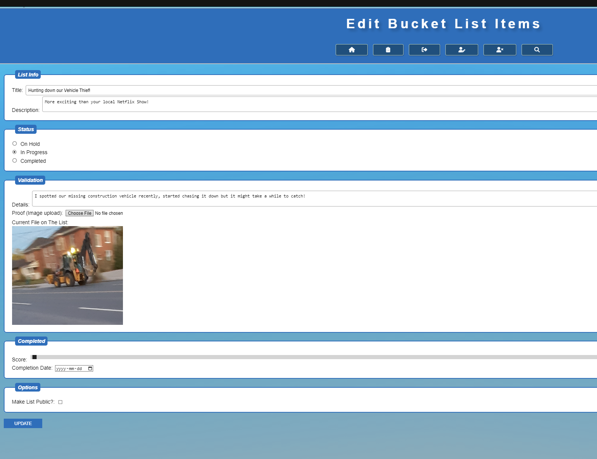
## Delete Item

### HTML/PHP

```xml

<?php
require './includes/library.php';

session_start();

// Check if the user is logged in
if (!isset($_SESSION['username'])) {
    header("Location: login.php");
    exit();
}
if(isset($_GET['id'])){
    $list_id = $_GET['id'];
}
  $userid = $_SESSION['user_id'];

$pdo = connectDB();
// Check if the user has confirmed the account deletion
if (isset($_POST['DelList'])) {
    // Delete The List
    $stmtDeleteList = $pdo->prepare("DELETE FROM 3420_assg_lists WHERE user_id = ? AND list_id = ?");
    $stmtDeleteList->execute([$userid, $list_id]);

// Redirect to Home Page
header("Location: index.php");
exit();
}
?>

<!DOCTYPE html>
<html lang="en">
<head>
    <meta charset="UTF-8">
    <meta name="viewport" content="width=device-width, initial-scale=1.0">
    <script src="https://kit.fontawesome.com/05ad49203b.js" crossorigin="anonymous"></script>
    <title>Delete Item</title>
    <!-- include CSS-->
    <link rel="stylesheet" href="styles/main.css">
    <script defer src="js/scripts.js"></script>
</head>
<body>
    <header>
        <!--This will be the main heading of the page so users know what page they're on-->
        <h1>Delete Item</h1>
        <?php include './includes/nav.php' ?>
    </header>
    <main>
        <form action="" method="post">
            <fieldset>
                <legend>Confirmation</legend>
                <p>Are you sure you want to delete your Item? This action cannot be undone.</p>
                <div>
                    <button type="submit" name="DelList" class="big-button">Yes, I'm sure. Delete my Item</button>
                </div>
            </fieldset>
        </form>
    </main>
    <?php include './includes/footer.php' ?>
</body>
</html>

```

### Testing
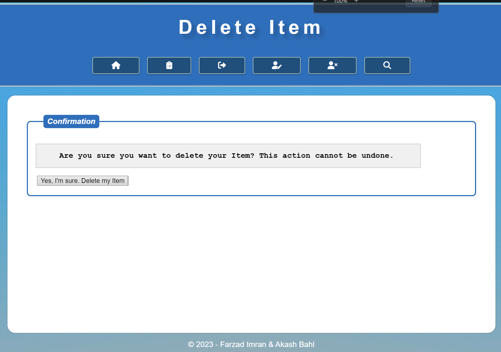
## Display Item Details

### HTML/PHP

```xml
<?php
session_start(); // Start the session

require './includes/library.php';

// Assume you have the item ID passed as a parameter in the URL (e.g., view-item.php?id=1)
if(isset($_GET['id'])){
  $list_id = $_GET['id'];}
  $userid = $_SESSION['user_id'] ?? null;

if (!$itemId) {
    // Redirect or handle the case where no item ID is provided
    header("Location: index.php");
    exit();
}

$pdo = connectDB();

// Check if the item is public or if the user is the owner
$check = "SELECT user_id, publicity FROM 3420_assg_lists WHERE list_id = ?";
$checkownership = $pdo->prepare($check);
$checkownership->execute([$itemId]);
$result = $checkownership->fetch(PDO::FETCH_ASSOC);

// If the item is private and the user is not the owner, or if the item is not found, redirect to index.php
if (!$result || ($result['publicity'] == "Private" && $result['user_id'] != $userid)) {
    header("Location: index.php");
    exit();
}

// Fetch the data if the item is public or if the user is the owner
$stmt = $pdo->prepare("SELECT * FROM 3420_assg_lists WHERE list_id = ?");
$stmt->execute([$itemId]);
$item = $stmt->fetch();

// Check if the item is not found
if (!$item) {
    // Redirect or handle the case where the item is not found
    header("Location: index.php");
    exit();
}
?>

<!DOCTYPE html>
<html lang="en">
  <head>
    <meta charset="UTF-8">
    <meta name="viewport" content="width=device-width, initial-scale=1.0">
    <script src="https://kit.fontawesome.com/05ad49203b.js" crossorigin="anonymous"></script>
    <title>View Item</title>
    <!-- include javascript and css-->
    <link rel="stylesheet" href="styles/main.css">
    <script defer src="js/scripts.js"></script>
  </head>
  <body>
    <header>
      <!--This will be the main heading of the page so users know what page they're on-->
      <h1>View Item</h1>
      <?php include './includes/nav.php' ?>
    </header>
    <main>
      <!-- Display item content using the fetched data -->
      <form id="view-form" method="post" action="">
        <fieldset>
          <legend>List Info</legend>
          <div>
            <label for="title">Title:</label>
            <input type="text" id="title" name="title" value="<?php echo $item["title"]; ?>" readonly>
          </div>
          <div>
            <label for="title">Description:</label>
            <input type="text" id="description" name="description" value="<?php echo $item["description"]; ?>" readonly>
          </div>
          <div>
            <label for="rating">User Score: <?php echo $item["rating"]?></label>
            <input type="range" id="rating" name="rating" min="1" max="100" value="<?php echo $item["rating"]; ?>" disabled>
            <output for="rating"></output>
          </div>
          <div>
          <label for="title">Completion Date:</label>
            <input type="date" value="<?php echo $item["completion_date"]; ?>" disabled>
            </div>
        </fieldset>
        <fieldset>
          <legend>Description</legend>
          <div>
            <label for="details">Details:</label>
            <p><?php echo $item['details']; ?></p>
          </div>
          <!-- Other HTML elements using data from $item -->
          <div>
            <?php if (isset($item['image_url'])): ?>
              <label>Image Proof:</label>
              " height="300">
            <?php endif; ?>
          </div>
        </fieldset>
      </form>
    </main>
    <?php include './includes/footer.php' ?>
  </body>
</html>
```

### Testing
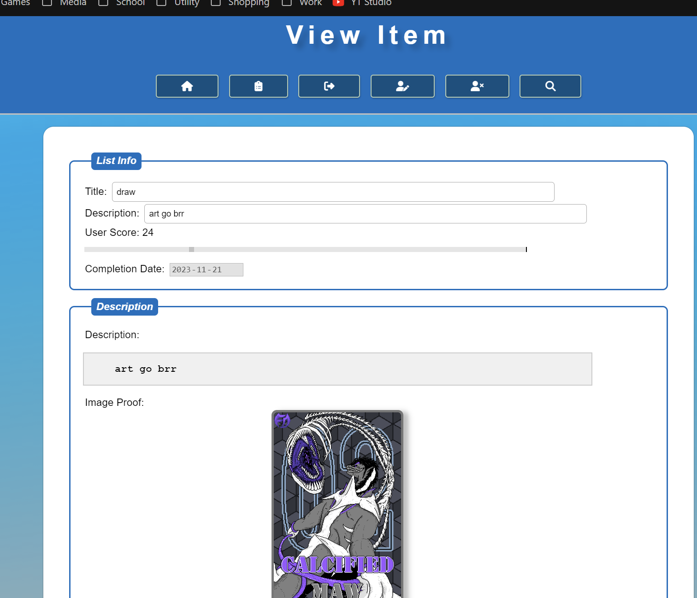
## Search

### HTML/PHP

```xml
<?php
session_start();

require_once "includes/library.php";
$pdo = connectDB();

$search = $_POST['search'] ?? "";
$errors = array();
$userLists = array();
$varpub ="Public";

if(isset($_POST['submit'])){

  $search = strip_tags($search);
  if($search == ""){
    $errors['search'] = true;
  }

  if (!count($errors)){
    $pdo = connectDB();

    // Use wildcards for a partial match
    $searchTerm = "%$search%";
    $query = "SELECT * FROM 3420_assg_lists WHERE `title` LIKE ? AND publicity = ? OR `description` LIKE ? AND publicity = ?";
    $stmt = $pdo->prepare($query);
    $stmt->execute([$searchTerm, $varpub, $searchTerm, $varpub]);
  }
}

?>

<!DOCTYPE html>
<html lang="en">

<head>
    <meta charset="UTF-8">
    <meta name="viewport" content="width=device-width, initial-scale=1.0">
    <script src="https://kit.fontawesome.com/05ad49203b.js" crossorigin="anonymous"></script>
    <title>Search</title>
    <!-- include javascript and css-->
    <link rel="stylesheet" href="styles/main.css">
    <script defer src="js/scripts.js"></script>
</head>

<body>
    <header>
        <!--This will be the main heading of the page so users know what page they're on-->
        <h1>Search</h1>

        <?php include './includes/nav.php' ?>
    </header>
    <div>
        <form id="search-form" class="search-form" method="post">
            <input
                type="text"
                class="search_input"
                placeholder="Search for lists in the form"
                name="search"
                value="<?=$search?>"
            />
            <span class="<?= isset($errors['search']) ? "" : "hidden"; ?>">
                You must enter a search
            </span>
            <!--Added name attribute for the search input ^-->
            <button type="submit" name="submit" class="search_button">
               <i class="fa-solid fa-magnifying-glass"></i>
            </button>

            <!-- Random id picker for the feeling lucky function -->
            <?php
            $rand = "SELECT list_id FROM 3420_assg_lists WHERE publicity = ? ORDER BY RAND() LIMIT 1;";
            $randid = $pdo->prepare($rand);
            $randid->execute([$varpub]);
            $listid = $randid->fetch(PDO::FETCH_ASSOC);
            ?>

            <button type="button" class="feelin_lucky"><a class="feelin_lucky" href="view-item.php?id=<?php echo $listid["list_id"]; ?>">Feelin Lucky?</button>
        </form>
    </div>

    <div>

    <?php if (isset($_POST['submit']) && !count($errors)) : ?>
      <h2>Search Results for <?= $search; ?></h2>
      <?php if ($stmt->rowCount() <= 0) : ?>
        <p>No Results found</p>
      <?php else : ?>
        <ul>
        <?php foreach ($stmt as $row) : ?>
            <li><a href="view-item.php?id=<?= $row['list_id'] ?>"><?= $row['title'] ?></a></li>
          <?php endforeach ?>
        </ul>
      <?php endif ?>
    <?php endif ?>
    </div>

  <?php include './includes/footer.php' ?>
  </body>
</html>

```

### Testing
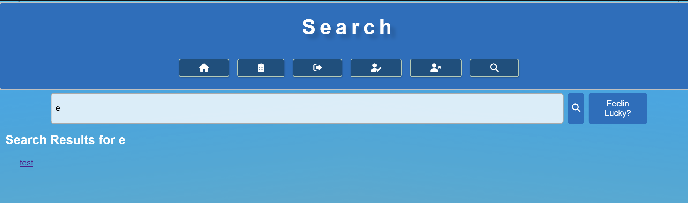
## Styles

```css
/* Importing a CSS reset file */
@import 'reset.css';

/* Common styles for the entire page */
:root {
  font-family: 'Helvetica', sans-serif;
  font-size: 1em; /* Base font size */
  font-weight: 400;
  background-color: white;
  color: black;
}

/* Header Styles */
header {
  background-color: #0070c0; /* Header background color */
  color: white; /* Text color in the header */
  text-align: center;
  padding: 0.5em 0; /* Top and bottom padding */
  display: block;
  padding: 0.5em 2.4em; /* Left and right padding */
  border-radius: 0.35em; /* Rounded corners */
  border: 0.15em solid #C0C0C0; /* Border style */
  margin: 0.15em 0; /* Top and bottom margin */
}
/* Body Styles */
/* Body Styles */
body {
  display: flex;
  flex-direction: column;
  font-family: Arial, sans-serif;
  min-height: 100vh;
  font-size: 1em;
  background: url("../images/BGColour.png") top left no-repeat fixed;
  background-size: cover;
  /* Background image with fixed position */
}

/* Navigation Styles */
nav a,
nav a:visited,
nav button {
  text-decoration: none;
  color: white;
  display: inline-block;
  padding: 0.5em 2.4em;
  border-radius: 0.25em;
  border: 0.1em solid #B1CCB4;
  text-align: center;
  box-shadow: 0.05em 0.1em 0.15em rgba(0, 0, 0, 25%);
  margin-top: 0.5em;
  background-color: #005080;
  cursor: pointer;
}

/* Hover state for buttons and nav links */
nav a:hover,
nav a:visited:hover,
nav button:hover, i[class="fa-solid fa-pen-to-square"]:hover{
  color: white;
  background-color: green;
  transform: scale(1.2);
  /* Change the background color on hover */
}

/* "Mid-click" state for buttons and nav links */
nav a:active,
nav a:visited:active,
nav button:active {
  color: black;
  background-color: darkgreen;
  /* Change the background color on click */
}

nav ul {
  display: flex;
  justify-content: space-around;
  flex-direction: row;
  max-width: 30rem;
  margin: 0 auto;
}

/* Additional Styles */
form {
  margin: 0.5em;
  padding: 0.5em;
}

/* Fieldset's label */
legend {
  background-color: #0070c0;
  color: white;
  font-style: italic;
  margin: 0 1em; /* no extra top/bottom margins */
  padding: 0.35em 0.50em;
  border-radius: 0.35em;
  font-weight: 600;
}

fieldset {
  background-color: white;
  border: 0.15em solid #0070c0;
  border-radius: 0.5em;
  padding: 1em 7em 1em 1em;
  margin-bottom: 0.75em;
}


fieldset div label, fieldset div {
  margin: 0.2em;
}

label {
  display: inline-block;
  margin-bottom: 0.5em;
}

/* Form input fields */
input[type="text"],
textarea, input[type="password"], input[type="range"] {
  width: 85%;
  padding: 0.5em;
  border: 0.06em solid #ccc;
}

input[type="radio"], input[type="checkbox"] {
  margin-right: 0.25em;
}

input[type="file"] {
  margin-bottom: 0.5em;
}

input[type="submit"], button[id="submit"] {
  background-color: #0070c0;
  color: white;
  padding: 0.5em 2.4em;
  border: none;
  cursor: pointer;
  text-transform: uppercase;
  margin-top: 0.5em;
}

input[type="submit"]:hover, button[id="submit"]:hover {
  background-color: #005090;
  transform: scale(1.2);
}

/* Header H1 Styles */
header h1 {
  text-align: center;
  font-weight: 600;
  font-size: 2rem;
  margin: 0.2em 0;
  font-size: 2.5rem;
  letter-spacing: 0.2em;
  text-shadow: 0.2em 0.2em 0.2em rgba(0, 0, 0, 0.2);
  padding: 0.25em 0;
}

main {
  background-color: white;
  max-width: 60rem;
  margin: 1em auto;
  border-radius: 1em;
  padding: 1.5em;
  flex-grow: 1;
  width: 100%;
  box-shadow: 0 0 0.1em rgba(0, 0, 0, 0.5);
}

main pre {
  margin-bottom: 0.75em; 
}

main p {
  font-weight: 600;
  margin: 1em 0;
  text-indent: 2em;
  text-align: justify;
  background-color: #f0f0f0; /* Set a light gray background color */
  padding: 1em;
  border: 0.1em solid #ccc; /* Add a light border for separation */
  font-family: 'Courier New', monospace; /* Use a monospace font for code */
  font-size: 1em;
  margin: 1em 0; /* Add margin for separation */
  overflow-x: auto; /* Add horizontal scrollbar if content overflows */
}

main img {
  display: block;
  margin: 0 auto;
  height: 25%;
  width: 25%;
  border: 0.25em solid #777;
  border-radius: 0.5em;
  box-shadow: 0.5em 0.15em 0.5em rgba(0, 0, 0, 0.25);
}

/* Buttons */
button.btn, i[class="fa-solid fa-pen-to-square"], i[class="fa-solid fa-trash"]{
  background-color: #0070c0;
  color: white;
  border: none;
  border-radius: 0.35em;
  padding: 0.4em 1em;
  cursor: pointer;
  margin-bottom: 0.2em;
}

i[class="fa-solid fa-trash"]:hover  {
  background-color: red;
  transform: scale(1.2);
}

/* Form input fields */
input[type="text"],
input[type="password"],
textarea {
  background-color: rgba(255, 255, 255, 0.8);
  border: 0.1em solid #aaa;
  border-radius: 0.35em;
  padding: 0.5em;
}

/* Form input focus */
input[type="text"]:focus,
input[type="password"]:focus,
textarea:focus {
  border-color: #0070c0;
  box-shadow: 0 0 0.25em rgba(0, 112, 192, 0.5);
}

/* Footer styles */
footer{
  color: white;
  font-size: 1em;
  text-align: center;
  margin-top: auto;
  margin-bottom: 0.5em;
}

/* Responsive design (adjust for smaller screens) */
@media (max-width: 48em) {
  header h1 {
    font-size: 2rem;
  }

  nav a {
    padding: 0.5em 1.7em;
  }

  button.btn {
    color: white;
    padding: 0.5em 0.8em;
  }
}

h2 {
  text-align: left;
  font-weight: 550;
  font-size: 1.5em;
  padding-bottom: 0.5rem;
  margin-top: 1rem;
  margin-left: 0.5em;
}

li {
  padding: 0.5rem;
  margin: 0.5rem 0;
}

main h2 {
  text-align: left;
  font-weight: 600;
  font-size: 1.3rem;
  margin: 0.3em 0em;
}
ul {
  margin-left: 2em;
} 
button.search_button,
button.feelin_lucky {
  background-color: #0070c0;
  color: white;
  border: none;
  cursor: pointer;
  padding: 0.3em 0.5em;
  margin-left: 0.5em;
  border-radius: 0.3em; /* Rounded corners */
}

button.search_button:hover,
button.feelin_lucky:hover {
  transform: scale(1.2);
}

form.search-form {
 display: flex;
 flex-direction: row;
 transform: scale(1.2);
 margin: 0 auto;
 max-width: 60rem;
}

.search_input {
  width: 80%; /* Use a percentage for width */
  height: 2.5em; /* Use em for height */
  padding: 0.5em; /* Use em for padding */
  border: 0.25em solid #ccc;
  border-radius: 0.15em;
}
/* Error Message*/
.error {
  display: inline-block;
  color: palevioletred;
  font-style: italic;
  margin: 1em;
}

div>.error {
  /* if error is in div, no top/bottom margins needed*/
  margin: 0 1em;
}

.hidden {
  display: none;
}

a.feelin_lucky{
  text-decoration: none;
  color: white;
}

```

_if for some reason you ended up with more then one stylesheet, they should be labelled_
